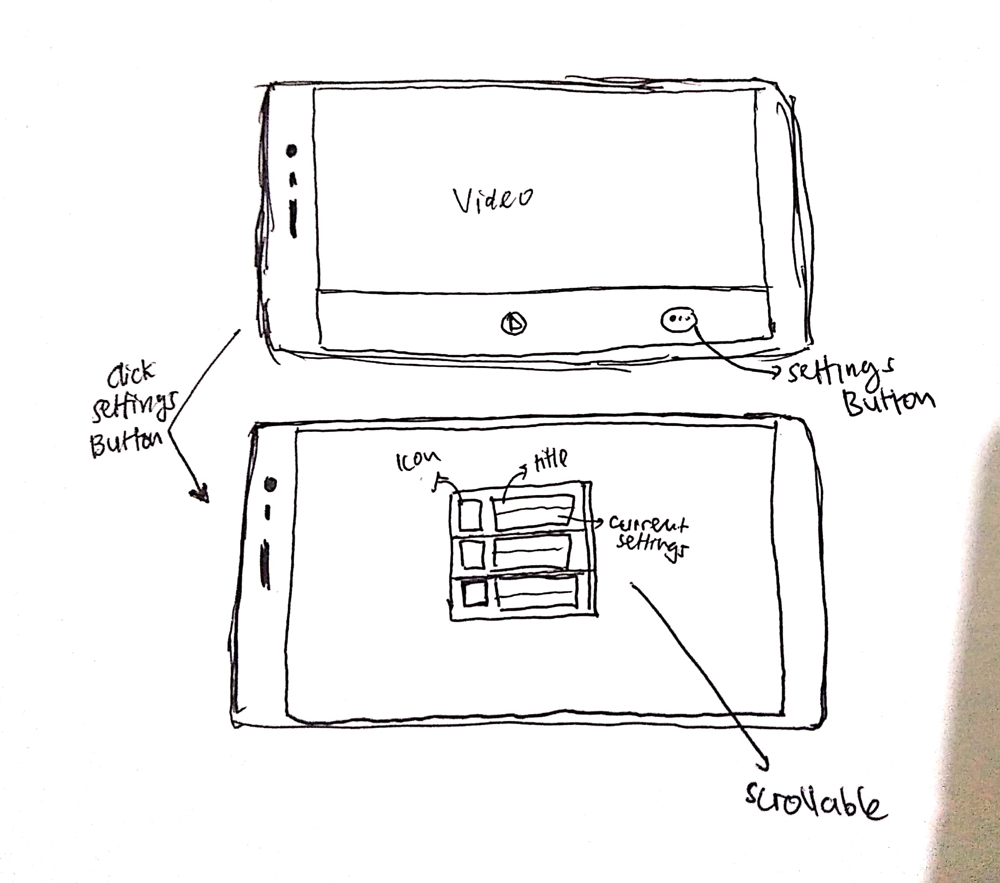
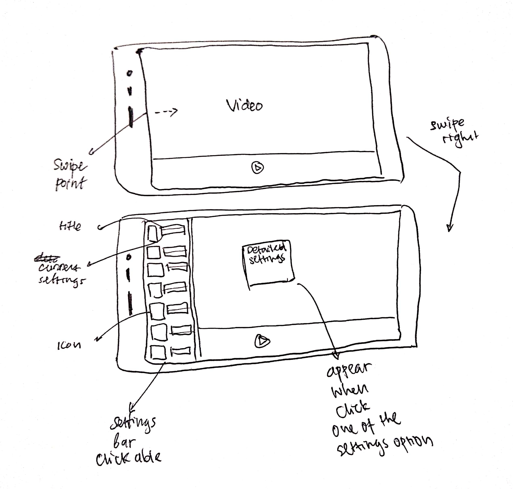
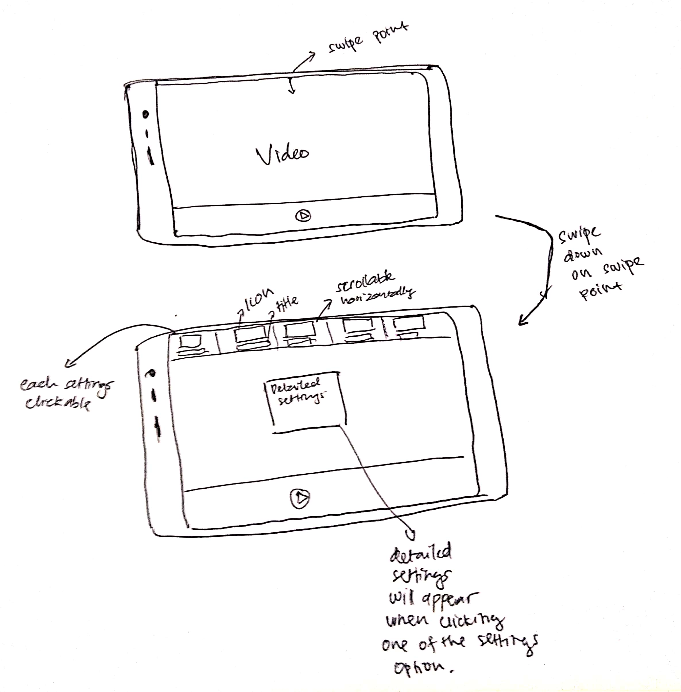

# Outline
- [Part A: Sketches](#part-a-sketches)  
    - [Scan/Photo of Sketches](#1-scan/photo-of-sketches)
        - [First Design](#first-design)
        - [Second Design](#second-design)
        - [Third Design](#third-design)
    - [Version Differences](#2-version-differences)
        - [First Design](#first-design-1)
        - [Second Design](#second-design-1)
        - [Third Design](#third-design-1)
    - [Design Rationale](#4-design-rationale)
- [Part B: Assumptions](#part-b-assumptions) 
    - [Hardware](#1-hardware)
    - [Users](#2-users)
- [Part C: Prototype](#part-c-prototypes)

# Sketching and Prototyping
Using the information in the results of Assignment 1 for what is good and bad about the UI for designed tasks, we are going to make **Sketches** and **Prototypes**. These sketches and prototypes will lead to better design in Assignment 3. The prototypes will be then tested through a usability evaluation followed by design revision in Assignment 4.

## Part A: Sketches
Sketch at least **3 (three)** different UIs for the functions you are targeting. These three interfaces should be _dramatically different_ in terms of design directions. For example, they can be with different organizations of what functions on each screen or using a different layout of the icons, widgets, and menus on the screens. If you want, you can also incorporate non-on-screen UIs: physical buttons, gestures through motion sensors, etc.

You need **not** sketch the whole interface. It is not necessary for the sketches to have every function or every function in detail, but there should be enough to show off your general idea. **Be creative!** Draw your idea and label a few of the widgets so we can tell your intent. The goal is to have at least 3 good UIs in *interesting* ways. Sketches should be done on paper with pens and/or pencils (do not use a computer).

### 1. Scan/Photo of Sketches
#### First Design

#### Second Design

#### Third Design

### 2. Version Differences

#### First Design
The first design is a little bit similiar to the original. Instead using only icon on the settings menu and it will become ambiguos, My first design use an icon with little information such as title of the settings and current settings applied on the right side of the icon. It will make users more understand and not guessing the settings menu. The settings bar are scrollable and clickable.

#### Second Design
The second design is a little bit similar with the first design but with different position on the screen. The settings bar on this design is relocated to the left side of the screen. Each settings menu on the settings bar also contains icon and little information about the setting such as the title and the current settings applied.

#### Third Design
The third design is relocated to the top of the screen. The settings menu could be activated by simply swipping down in the top of the screen. The settings menu contains icon and title of the settings menu. Each of the settings menu are clickable and the setting bar are scrollable horizontally. 

### 3. Selected Sketch
I select my second design for parts B and C because it is easier to access and it contains lot of information about the settings itself such as the current settings applied and the icon also the title of the settings.

### 4. Design Rationale
The users tend to guessing the settings based on the icon they know. It is not 100% correct and sometimes takes 2 or 3 attempt to get to the correct settings menu. The users also complained about small button and plain template.

## Part B: Assumptions
Because I reviewed about android application so the requirements are
### 1. Hardware
1. Android Smartphone.
2. Screen size between 4" and 6".
3. Touch Screen.
4. Running Android marshmallow or higher.
5. 1 GB of RAM or higher.

### 2. Users
1. Users should be familiar with smartphone.
2. Users able to operate smartphone with touch screen.
3. Age range between 10 - 70.
4. Have experience watching videos on smartphone.

## Part C: Prototypes  
### Freehand  

More details check this link: https://projects.invisionapp.com/freehand/document/oLOXbBb21

### Prototype  
  
More details check this link: https://invis.io/UTR8HVE4W2P